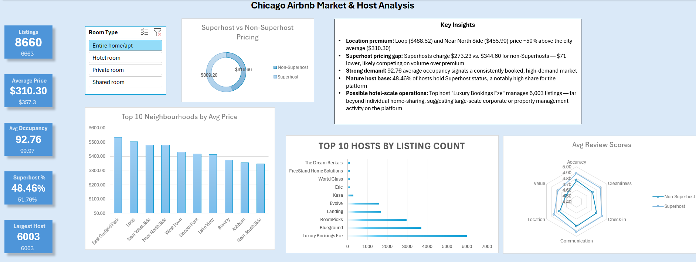

# Chicago Airbnb Market & Host Analysis

An interactive Excel dashboard analyzing 8,660 real Airbnb listings in Chicago, exploring pricing patterns, host concentration, and guest satisfaction using Power Query and PivotTables.

## Overview

This project takes raw, publicly available Airbnb listings data and transforms it into a fully interactive business dashboard — no coding required, built entirely in Excel. The goal was to answer real market questions a host, investor, or city regulator might actually ask:

- Which neighborhoods command the highest prices?
- Does Superhost status actually translate into higher prices or better reviews?
- Are there signs of large-scale, hotel-style operators disguised as individual hosts?
- How satisfied are guests, and does that satisfaction vary by host type?

## Key Insights

- **Location premium:** Loop ($488.52) and Near North Side ($455.90) price ~50% above the citywide average ($310.30)
- **Superhost pricing gap:** Superhosts charge $273.23/night on average vs. $344.60 for non-Superhosts — a $71 gap, suggesting Superhosts compete on volume rather than premium pricing
- **Quality gap in the opposite direction:** Despite lower prices, Superhosts scored higher across all 6 review categories (accuracy, cleanliness, check-in, communication, location, value) — largest gaps in Value and Cleanliness
- **Strong market demand:** Average estimated occupancy of 92.76 (out of 365 days) indicates a consistently booked, high-demand market
- **Mature host base:** 48.46% of hosts hold Superhost status
- **Possible hotel-scale operations:** The top host, "Luxury Bookings Fze," manages **6,003 listings** — far beyond individual home-sharing, suggesting large-scale corporate or property management activity operating on the platform

## Tools & Techniques

- **Data cleaning:** Power Query — fixed currency-formatted price fields, handled nulls, removed unnecessary columns from the raw 70+ column dataset
- **Analysis:** PivotTables for all core metrics (price, occupancy, review scores, host concentration)
- **Visualization:** Bar charts, donut chart, radar chart — chosen deliberately for variety and to match the specific comparison each answers
- **Interactivity:** A Room Type slicer connected across every chart and KPI card via Report Connections, so the entire dashboard updates live when filtered
- **KPI Cards:** Dynamic summary metrics (Total Listings, Average Price, Avg Occupancy, Superhost %, Largest Host Portfolio) built with `GETPIVOTDATA` so they respond to the slicer in real time

## Data Source

Data from [Inside Airbnb](http://insideairbnb.com/) — Chicago listings snapshot. Inside Airbnb compiles publicly scraped, real Airbnb listing data (not synthetic), independently of Airbnb itself.

## Files

- `Chicago Airbnb Market & Host Analysis.xlsx` — the full interactive dashboard (open in Excel to use slicers/filters)
- `Dashboard_Screenshot.png` — static preview image

## Limitations

- `estimated_occupancy_l365d` is Airbnb's own modeled estimate, not confirmed booking data
- Superhost status reflects a snapshot in time and may not match a host's status at the time of individual reviews
- Some scatter/radar analyses in supporting sheets are static (not slicer-connected) due to Excel chart-type limitations

## Contact

Feel free to reach out with questions or feedback — jgayathriforwork@gmail.com
